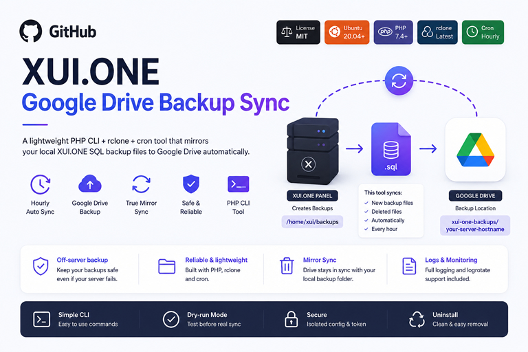

<p align="center">
  
</p>

<br>

# 🚀 XUI.ONE Google Drive Backup Sync


A lightweight **PHP CLI + rclone + cron** tool that mirrors your local **XUI.ONE SQL backup files** from:

```bash
/home/xui/backups
```

to your **Google Drive** account automatically.

---

## 🧩 Why this project exists

XUI.ONE already creates backup files on your server, usually inside:

```bash
/home/xui/backups
```

For example:

```text
backup_2026-06-25_00:28:01.sql
```

That is useful, but there is one serious problem:

> ⚠️ If your server breaks, becomes unreachable, gets corrupted, or is lost, your backups may be lost with it because they are stored on the same server.

XUI.ONE also includes a Dropbox backup option, but in many environments it may be unreliable, inconsistent, or not work as expected.

This project solves that problem by automatically syncing your existing XUI.ONE backup files to **Google Drive**, giving you an additional off-server backup location.

✅ Local XUI.ONE backup stays on your server  
✅ Google Drive copy is created automatically  
✅ New backup files are uploaded  
✅ Deleted local backups are also deleted from Drive  
✅ Runs every hour with cron  
✅ Uses rclone for reliable Google Drive synchronization  

---

## ⚡ What it does

This tool does **not** create XUI.ONE backups itself.

It simply takes the backup files already created by XUI.ONE and mirrors them to Google Drive.

```text
XUI.ONE Panel
    ↓ creates backups
/home/xui/backups
    ↓ hourly cron
xui-gdrive-sync
    ↓ rclone sync
Google Drive / xui-one-backups / your-server-hostname
```

---

## ✨ Features

- 🚀 Automatic hourly backup synchronization
- ☁️ Google Drive support through rclone
- 🔁 True mirror sync between local backup folder and Drive
- 📤 Uploads new XUI.ONE backup files automatically
- 🗑️ Removes remote Drive files when they are deleted locally
- 🧪 Dry-run mode before real synchronization
- 🛡️ Empty-source protection to prevent accidental Drive wipes
- 🔐 Isolated rclone config file
- 🧾 Log file support
- ♻️ Logrotate support
- 🧰 Simple PHP CLI command
- 🧱 No database required
- 🌐 No web panel required
- 🧹 Uninstall script included

---

## 🛡️ Why Google Drive backup is safer

Keeping backups only on the same server is risky.

If the server disk fails, the operating system breaks, the provider suspends the machine, or the server becomes inaccessible, you may not be able to reach your local backup files.

With this tool, your XUI.ONE backups are also copied to Google Drive. This gives you a healthier and more reliable recovery path because your backup copy is stored outside the original server.

---

## ⚠️ Important sync behavior

This project uses `rclone sync`, not `rclone copy`.

That means Google Drive is kept in sync with the local backup directory.

If a file exists locally, it will be uploaded to Drive.  
If a file is deleted locally, it will also be deleted from the configured Drive folder.

This is intentional because the Google Drive folder should match the server backup folder.

Always run a dry-run first:

```bash
sudo xui-gdrive-sync dry-run
```

---

## 📦 Requirements

- Ubuntu 20.04, 22.04 or 24.04
- Root SSH access
- PHP CLI
- cron
- rclone
- Google Drive account
- Existing XUI.ONE backups in `/home/xui/backups`

---

## 🚀 Installation

Clone this repository:

```bash
git clone https://github.com/rootwcore/xui-one-gdrive-backup-sync.git
cd xui-one-gdrive-backup-sync
```

Run the installer:

```bash
sudo bash install.sh
```

The installer creates the application files, config file, cron entry and log directory automatically.

---

## ⚙️ Custom installation

You can override default values during installation:

```bash
sudo SOURCE_DIR=/home/xui/backups \
     REMOTE_NAME=gdrive \
     REMOTE_DIR='xui-one-backups/{hostname}' \
     CRON_MINUTE=0 \
     bash install.sh
```

Default install paths:

```text
/opt/xui-gdrive-sync/sync.php
/etc/xui-gdrive-sync/config.php
/etc/xui-gdrive-sync/rclone.conf
/var/log/xui-gdrive-sync/sync.log
/etc/cron.d/xui-gdrive-sync
/etc/logrotate.d/xui-gdrive-sync
/usr/local/bin/xui-gdrive-sync
```

---

## ☁️ Configure Google Drive

Create the Google Drive remote with rclone:

```bash
sudo rclone config --config /etc/xui-gdrive-sync/rclone.conf
```

Recommended choices:

```text
n) New remote
name> gdrive
Storage> Google Drive / drive
Use auto config?> n
```

On a headless Ubuntu server, rclone will show an authorization URL or command. Complete the Google authorization on a computer with a browser, then paste the token back into the server.

Protect the rclone token file:

```bash
sudo chmod 600 /etc/xui-gdrive-sync/rclone.conf
```

---

## 🩺 Validate installation

Run:

```bash
sudo xui-gdrive-sync doctor
```

This checks PHP, rclone, source directory, config file and the configured rclone remote.

---

## 🧪 Test before real sync

Run a dry-run first:

```bash
sudo xui-gdrive-sync dry-run
```

If the output looks correct, run the real sync:

```bash
sudo xui-gdrive-sync sync
```

---

## 🕒 Hourly cron sync

The installer creates this cron job:

```cron
0 * * * * root /usr/local/bin/xui-gdrive-sync sync >/dev/null 2>&1
```

It runs once every hour.

To view the cron file:

```bash
cat /etc/cron.d/xui-gdrive-sync
```

To edit the schedule:

```bash
sudo nano /etc/cron.d/xui-gdrive-sync
sudo systemctl restart cron
```

---

## 🧰 Commands

```bash
sudo xui-gdrive-sync help
sudo xui-gdrive-sync doctor
sudo xui-gdrive-sync local
sudo xui-gdrive-sync remote
sudo xui-gdrive-sync status
sudo xui-gdrive-sync dry-run
sudo xui-gdrive-sync sync
sudo xui-gdrive-sync version
```

### Command overview

| Command | Description |
| --- | --- |
| `help` | Shows available commands. |
| `doctor` | Checks installation and configuration. |
| `local` | Lists local backup files. |
| `remote` | Lists files in the configured Google Drive folder. |
| `status` | Shows local and remote status. |
| `dry-run` | Simulates sync without changing Drive. |
| `sync` | Runs the real Google Drive synchronization. |
| `version` | Shows tool version. |

---

## ⚙️ Configuration

Main config file:

```bash
sudo nano /etc/xui-gdrive-sync/config.php
```

Default configuration:

```php
return [
    'source_dir' => '/home/xui/backups',
    'remote_name' => 'gdrive',
    'remote_dir' => 'xui-one-backups/{hostname}',
    'include_patterns' => [
        'backup_*.sql',
        'backup_*.sql.gz',
    ],
    'allow_empty_source' => false,
    'drive_use_trash' => false,
    'transfers' => 4,
    'checkers' => 8,
    'fast_list' => true,
    'stats_interval' => '30s',
    'log_level' => 'INFO',
    'extra_rclone_flags' => [],
    'log_dir' => '/var/log/xui-gdrive-sync',
    'rclone_config' => '/etc/xui-gdrive-sync/rclone.conf',
    'lock_file' => '/run/xui-gdrive-sync.lock',
];
```

### Important options

| Option | Description |
| --- | --- |
| `source_dir` | Local XUI.ONE backup directory. |
| `remote_name` | rclone remote name. Must match the remote created with `rclone config`. |
| `remote_dir` | Google Drive folder path. `{hostname}` is replaced with the server hostname. |
| `include_patterns` | Backup filename patterns to synchronize. |
| `allow_empty_source` | Prevents Drive wipe if the source folder is empty. |
| `drive_use_trash` | If `false`, deleted files are removed permanently instead of moved to Drive Trash. |
| `extra_rclone_flags` | Optional additional rclone flags. |

---

## 📁 Supported backup files

By default, this tool syncs:

```text
backup_*.sql
backup_*.sql.gz
```

You can change this from:

```bash
/etc/xui-gdrive-sync/config.php
```

---

## 🧾 Logs

View recent logs:

```bash
sudo tail -n 100 /var/log/xui-gdrive-sync/sync.log
```

Follow logs in real time:

```bash
sudo tail -f /var/log/xui-gdrive-sync/sync.log
```

---

## 🔐 Security notes

XUI.ONE SQL backups may contain sensitive data such as:

- Panel users
- Database records
- Server settings
- Credentials
- Tokens
- License or activation-related data

Never commit these files to GitHub:

- SQL backup files
- rclone config files
- OAuth tokens
- server-specific config files
- log files
- activation or license data

For stronger privacy, create an rclone `crypt` remote on top of your Google Drive remote and set `remote_name` to the encrypted remote.

---

## 🧹 Uninstall

Remove application files and cron entry:

```bash
sudo bash scripts/uninstall.sh
```

The uninstall script does not remove configuration, OAuth tokens or logs by default.

To remove everything manually:

```bash
sudo rm -rf /etc/xui-gdrive-sync /var/log/xui-gdrive-sync
```

---

## 🧭 Recommended backup strategy

This tool is designed as an additional backup layer, not as your only backup solution.

Recommended setup:

```text
XUI.ONE local backup
        +
Google Drive sync
        +
separate server/provider backup if possible
```

The more independent your backup locations are, the safer your recovery process becomes.

---

## ❓ FAQ

### Does this tool create XUI.ONE backups?

No. XUI.ONE creates the backup files. This tool only syncs existing backup files to Google Drive.

### Does it replace XUI.ONE's built-in backup system?

No. It complements it by copying the generated backup files to Google Drive.

### What happens if I delete a local backup file?

The same file will be deleted from the configured Google Drive folder during the next sync.

### Should I run dry-run first?

Yes. Always run:

```bash
sudo xui-gdrive-sync dry-run
```

before the first real sync.

### Can I use another cloud provider?

The tool is designed around rclone, so it can potentially be adapted for other rclone-supported providers. The default documentation focuses on Google Drive.

---

## 🤝 Contributing

Contributions are welcome.

Before opening a pull request, please make sure you did not include:

- SQL backups
- OAuth tokens
- rclone config files
- real server paths containing private data
- license or activation information

---

## ⚖️ Disclaimer

This project is not affiliated with, endorsed by, sponsored by or officially connected to XUI.ONE.

Use it only on servers, systems and backups that you own or are authorized to manage.

---

## 📄 License

MIT License. See [LICENSE](LICENSE).
